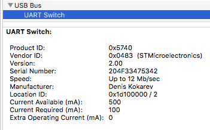

# UART Switch

This is a helper debugging device to switch the output of a proprietary box. The box connects via 2x4 Header.
There are 3 operation modes when the corresponding pins are connected:
- 0 Off: neither pins connected
- 1 SOC: (2 <-> 3) (5 <-> 6)
- 2 DBG: (2 <-> 1) (5 <-> 4) 


The modes may be switched either with a button or via serial terminal

- Directly from command line
```
echo -n "2" >/dev/cu.usbmodem1D11
```
- By Using `screen`
```
screen /dev/cu.usbmodem1D11
```


The device is shows up in the USB list



## [Hardware](./hardware)

## [Firmware](./firmware)
 
