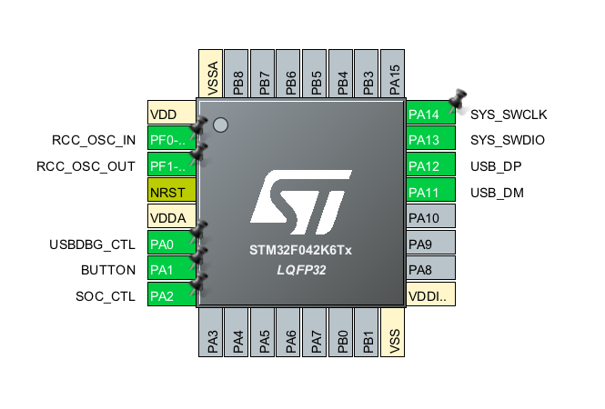

# Firmware

The template created with Cube MX. The code is developed using CLion.

You can tweak firmware.ioc in Cube MX and regenerate the code. Then you can continue development in CLion.

Current pins assignment:


# Build
Download and install ARM toolchain: https://developer.arm.com

## option 1 - CLion

- Open CLion with firmware project
```
export PATH=$PATH:/Applications/ARM/bin
open /Applications/CLion.app/ --args .
```
- Click Build

## option 2 - command line
```
export PATH=$PATH:/Applications/ARM/bin
mkdir -p cmake-build-release
cd cmake-build-release
cmake -DCMAKE_BUILD_TYPE=Release ..
cmake --build . -- -j
```


# Flash
- Using CLion
Just press `Run` - it'll use `openocd` under the hood.
- Using OpenOCD
```
brew install openocd
openocd -f ./stm32f0_via_stlink.cfg -c "program \"./cmake-build-release/firmware.elf\"" -c reset -c shutdown
```
- Using st-utils
```
brew install stlink
st-flash write cmake-build-release/firmware.bin 0x8000000
```

# Code
Functionality is included in Core/Src|Inc:
## modes.c
Custom functionality to manage modes and perform I/O. It is plugged into Cube MX template with the following 2 files:
## main.c
`HAL_GPIO_EXTI_Callback()` - button interrupt handler
`main()` - input_ch polling loop
## usbd_cdc_if.c
`CDC_Receive_FS()` - populate input_ch
